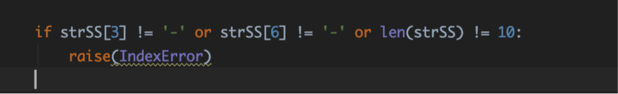
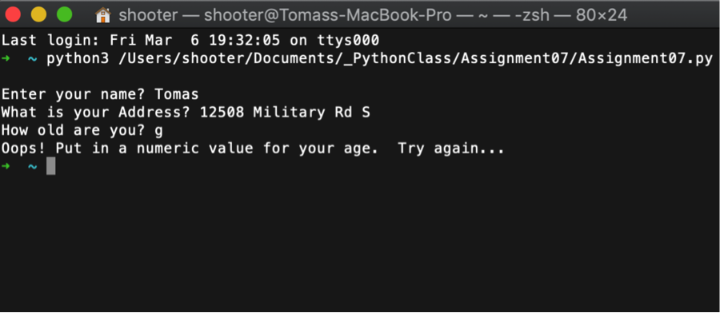

# The largest heading
## The second largest heading
###### The smallest heading

# Pickle & Structured Exceptions

## Introduction

In this assignment I searched the web to learn about pickling data and storing it in a dat file and learned how to use structured exceptions so I may make my own user-friendly errors for the end user.  I made a simple program that takes in sensitive data from the user and stores the data in binary and gives friendly errors when data is entered incorrectly.

## Pickling 

In this assignment I first start by importing the pickle module. I asked the user multiple sensitive question once I asked the use multiple  question I captured the data using a variable. I open a new file and use the ‘wb’ for writing in binary. Once I open the file in ‘wb’ mode I use the pickle function ‘dump’ to populate the dat file with the information I would like. The data I choose to populate is the same data I accepted from the user. See figure 1 for the functions I call to open and write to the file in binary. 

Figure 1: how to open file in wring binary mode and write the data to the file

Now once you look at the dat file you can see the text is unreadable to the human eye. See figure 2 for what has been written in the dat file. 

Figure 2: unreadable to human eye text file 

## Structured Exceptions 
In my code I make it throw two errors, one for ‘ValueError” which means when the user inputs an incorrect data type the program will give the users a error warning. I use this error specifically for if the user does not put in a numeric value for their age. See figure 3 for how I wrote the code. 

Figure 3 : ValueError user friendly error

The next exception error I used in my code is the “IndexError” exception. If the user does not put in the correct amount of value in the code it will throw the index error. See figure 4 for the IndexError exception. 

Figure 4: IndexError user friendly error

The last exception I throw it I force raise an exception if the user does not put their social security in the correct format that I like. I use a if statement that makes sure the user puts in 10 value and the 4th and the 7th values are ‘-‘. See figure 5 for the if statement and raised logic.

Figure 5: Force raise logic for formatting of social security 

## Running code on Terminal 
I simply ran the program on my terminal by using the python3 command and the link to the file. When running my code I went ahead and made the mistake of putting a letter instead of a numeric value for the age. The program sends back a user friendly error. See figure 6 for the output on the terminal. 

Figure 6: Running the program on the terminal

## Conclusion
Overall, through this assignment I was able to take in sensitive values from a user and place them in binary on a dat file. If the user does not place the information in the format I like the program will send back a user friend error message.

